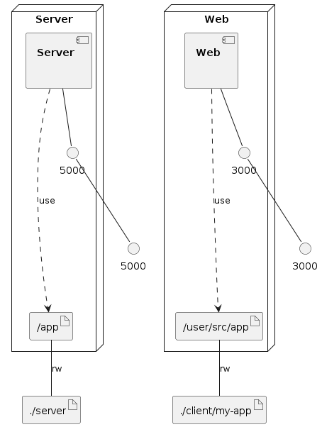

# How to run app.

- Make sure you have docker installed on local machine
- run `docker-compose-up`
- check that flask server is up by going to `http://localhost:5000/api`
- Navigate to `http://localhost:3000/` on the browser.

# Note

If you see this:

```
npm ERR! UpScore@0.6.0 start: `react-scripts start`
npm ERR! spawn ENOENT
```

It just means something went wrong when dependencies were installed the first time.

I suggest doing these three steps:

- `npm install -g npm@latest` to update npm because it is sometimes buggy.
- `rm -rf node_modules` to remove the existing modules.
- `npm install` to re-install the project dependencies.

Source - [Here By Dan Abramov](https://stackoverflow.com/questions/39959900/npm-start-error-with-create-react-app)

### Infrastructure model

